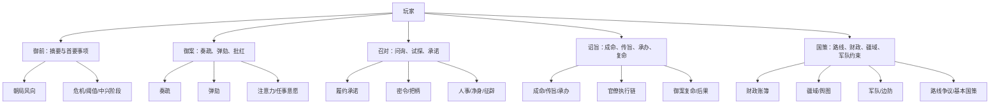

# 项目架构户籍清单

本文件回答三个问题：

1. 现在项目到底有多少模块和子功能。
2. 每个模块对玩家体验的意义是什么。
3. 哪些模块应该留作主循环，哪些应该合并、降级或隐藏。

当前盘点：

| 类别 | 数量 | 说明 |
|------|------|------|
| 后端 Python 顶层模块 | 74 | `ming_sim/*.py` |
| FastAPI 路由 | 121 | 含游戏、管理、画像、静态文件、健康检查 |
| content 配置文件 | 25 | 静态内容、规则、人物、地图、财政、国策 |
| 移动端 view 文件 | 9 | 5 个主 tab + 若干子面板 |
| docs 文件 | 39 | 旧方案、模块说明、生产文档、画像文档 |

结论：项目不是缺功能，而是功能太多且缺少父级。玩家真正需要面对的主系统应压缩到 **5 个一级入口**：御前、御案、召对、诏旨、国策。其余功能都必须挂到这 5 个入口之下。

---

## 推荐总架构

---

## 一级玩家系统（应该显式存在）

### 1. 国策中枢

| 项 | 内容 |
|----|------|
| 意义 | 游戏最高层战略入口，回答“朝廷现在走什么路线、为什么卡住、谁支持/反对、财政/疆域/军队是否支撑”。 |
| 主要文件 | `ming_sim/policies.py`, `ming_sim/policy_center.py`, `content/policy_doctrines.json` |
| 持久化 | `issues(origin_kind='doctrine')`, `legacies(legacy_key='doctrine:*')` |
| 子功能 | 路线分类、路线冲突、正统化门槛、派系/人物站队、相关奏疏、在办旨意、履约证据 |
| 应保留程度 | 主系统，最高优先级 |

国策中枢应该管住其他系统的解释权。财政、疆域、军队、净身、履约都不应该各自解释“国家路线”，只能向国策中枢提供证据和约束。

### 2. 财政中枢

| 项 | 内容 |
|----|------|
| 意义 | 回答“怎么赚钱、钱花在哪、余额为什么变、下月会缺多少”。 |
| 主要文件 | `ming_sim/flows.py`, `ming_sim/fiscal_center.py`, `docs/modules/economy.md`, `content/fiscal_config.json` |
| 持久化 | `economy_accounts`, `economy_ledger`, `regions.fiscal`, `regions.tax_per_turn`, `armies.arrears` |
| 子功能 | 固定月收支、每省税源、到账率、军饷、欠饷、内库/国库、财政流水、国策修正 |
| 应保留程度 | 主系统，但入口应嵌入国策页 |

财政不是一个独立小游戏，而是所有国策的硬约束。所有预算必须继续走 `compute_budget_lines()`；所有余额变化必须走 `economy_ledger`；所有玩家解释必须从 `FiscalCenter` 的财政三问、税源拆账、支出分组和流水摘要派生。

### 3. 国家机器中枢

| 项 | 内容 |
|----|------|
| 意义 | 参考《钢铁之心》的国家面板，把经济和官僚组织统一成库存、月流、产能、瓶颈。 |
| 主要文件 | `ming_sim/statecraft_center.py`, `ming_sim/fiscal_center.py`, `ming_sim/bureaucracy.py`, `docs/statecraft-hoi-rework.md` |
| 持久化 | 不新增状态表；读取 `economy_accounts`, `economy_ledger`, `buildings`, `characters`, `character_offices`, `offices`, `armies` |
| 子功能 | 顶栏库存、经济四条账、部门产能、建筑产能、官僚瓶颈警报 |
| 应保留程度 | 主解释层，应放在国策页财政与官制明细之前 |

国家机器中枢不是第三套经济系统。它只聚合 `FiscalCenter` 与 `organization_diagnostics()`，把“钱不够”和“衙门办不动”放进同一组瓶颈警报。后续诏旨、建筑、财政改革、军务都应显示自己消耗或依赖哪个产能。

### 4. 御案系统

| 项 | 内容 |
|----|------|
| 意义 | 皇帝注意力经济。奏疏、弹劾、复命、请款都在这里变成正式裁断。 |
| 主要文件 | `ming_sim/memorials.py`, `web/src/mobile/views/DeskView.tsx` |
| 持久化 | `memorials`, `attention` 相关 kv, `issues` |
| 子功能 | 待批奏疏、票拟、留中、批红、弹章、正式复命、注意力、崇祯陷阱 |
| 应保留程度 | 主系统 |

御案只应处理“正式入案”的事项。路线争议由这里推入批红，但最终路线解释回到国策中枢。

御案里的“复命”是正式案卷结果，来自办结旨意或捷报。它不是召对里追问旧约的“回访”，也不是诏旨页召主办问水分的“复盘”。

### 5. 召对系统

| 项 | 内容 |
|----|------|
| 意义 | 人治入口。玩家问询、试探、许诺、威胁、交换条件都在这里发生。 |
| 主要文件 | `ming_sim/session.py`, `ming_sim/registry.py`, `ming_sim/tools.py`, `ming_sim/dialogue_goals.py`, `ming_sim/dialogue_audit.py`, `ming_sim/negotiation.py` |
| 持久化 | `chat history`, `conversation_goals`, `negotiation_agreements`, `negotiation_tasks` |
| 子功能 | 大臣聊天、人物声音合约、召对目标、条件审计、承诺生成、握手履约、履约回访、密令、人物上下文 |
| 应保留程度 | 主系统 |

召对不应该直接推进国策进度。它只能生成承诺、草案、证词、把柄或密令，再由御案/诏旨/履约闭环落地。

召对里的回访追的是“人是否兑现承诺”，不是“旨意是否办结”。若要形成正式结果，必须转成御案、诏旨、账簿或国策证据。

召对还必须承担“人物活人感”的第一责任。性格、心盘、人脉、旧事和履约压力不能只停留在隐藏审计与执行风险里，必须显成玩家听得见的称谓、关注点、条件、隐瞒、护短、旧怨和句式差异。硬边界见 [人格与召对活人感重排](docs/personality-dialogue-rework.md)。

### 6. 诏旨系统

| 项 | 内容 |
|----|------|
| 意义 | 玩家意志进入官僚机器后的执行过程。 |
| 主要文件 | `ming_sim/decree.py`, `ming_sim/lifecycle.py`, `ming_sim/bureaucracy.py`, `ming_sim/edict_outcome.py`, `web/src/mobile/views/EdictsView.tsx` |
| 持久化 | `turn_directives`, directive lifecycle columns, `scheduled_resolutions` |
| 子功能 | 草案、颁诏、成命、传旨、承办、执行链、阻力、催办/换人/加拨、复命、复盘、后果落库 |
| 应保留程度 | 主系统 |

诏旨只负责执行生命周期和结果，不应该自己成为国策解释面板。

诏旨系统的硬边界见 [旨意周期与回报机制重排](docs/decree-cycle-and-reports.md)：**下达即成命，不应耗时**；耗时只能来自传旨和承办。净身、收押、京中近身任差等同日直接处置，必须绕开通用 `lead_days + exec_days` 长周期模型。

---

## 二级玩法系统（应该降为子功能）

### 7. 疆域与舆图

| 项 | 内容 |
|----|------|
| 意义 | 国策约束面板：动乱、民望、士绅阻力、控制权、边防压力。 |
| 主要文件 | `content/regions.json`, `web/src/mobile/views/RealmMap.tsx`, `/api/map` |
| 子功能 | 地图、地区列表、动乱色阶、地方风险 |
| 归属 | 国策中枢 |
| 处理建议 | 保留展示，取消“天下”独立一级入口。 |

### 8. 军队与边防

| 项 | 内容 |
|----|------|
| 意义 | 国策与财政的硬约束：军饷、欠饷、士气、自专、边镇压力。 |
| 主要文件 | `content/armies.json`, `ming_sim/frontier.py`, `ming_sim/combat.py`, `docs/modules/armies.md` |
| 子功能 | 欠饷、士气、补给、监军太监、军镇自专、战斗计算 |
| 归属 | 国策中枢 + 财政中枢 |
| 处理建议 | 军队面板只解释边防约束，不再单独形成主循环。 |

### 9. 人物、人事与官制

| 项 | 内容 |
|----|------|
| 意义 | 执行者与政治对象。政策不是按钮，而是穿过人。 |
| 主要文件 | `ming_sim/court.py`, `ming_sim/personnel_actions.py`, `ming_sim/foundation.py`, `ming_sim/lifespan.py`, `ming_sim/traits.py`, `ming_sim/xinpan.py`, `web/src/mobile/Person.tsx` |
| 子功能 | 人物详情、官职、征辟、任免、寿命病死、性格特质、动态影响层 |
| 归属 | 召对 + 御案 + 诏旨执行链 |
| 处理建议 | 人物详情保留，但入口要从具体事件/奏对进入，不要让人物系统抢主循环。 |

### 10. 派系、朝堂剧场与信念变量

| 项 | 内容 |
|----|------|
| 意义 | 让“皇权是均衡”可见。势、任事意愿、派系热度决定执行与反噬。 |
| 主要文件 | `ming_sim/theater.py`, `ming_sim/faction_dynamics.py`, `ming_sim/political_reactions.py`, `ming_sim/ambition.py` |
| 子功能 | 势、任事意愿、派系出招、信号动作、买单/问罪、人物私心 |
| 归属 | 御案 + 诏旨 + 首页朝局风向 |
| 处理建议 | 保留规则，减少独立面板。只在产生行动时出现。 |

### 11. 履约、密令与承诺账本

| 项 | 内容 |
|----|------|
| 意义 | 让“言语即落子”。玩家说过的话、官员答应的事都应变成可追踪契约。 |
| 主要文件 | `ming_sim/negotiation.py`, `ming_sim/obligations.py`, `ming_sim/dialogue_goals.py` |
| 持久化 | `negotiation_agreements`, `negotiation_tasks`, `conversation_goals` |
| 子功能 | 握手、承诺任务、到期检查、履约评分、失诺后果 |
| 归属 | 召对系统 |
| 处理建议 | 从平行主循环降级为召对的承诺层；国策页只显示相关证据。 |

履约系统的玩家文案应叫“履约回访”或“旧约追问”。不要把它和御案“复命”混称为回报。

### 12. 密查、阴谋与文书黑箱

| 项 | 内容 |
|----|------|
| 意义 | 让数字有出处，且可能被骗。玩家通过密查、盘库、把柄来戳破文书。 |
| 主要文件 | `ming_sim/veil.py`, `ming_sim/intrigue.py`, `ming_sim/report.py` |
| 持久化 | `report_ledger`, secrets/hooks 相关表 |
| 子功能 | 文书矛盾、密查、把柄、挟制、罗织、离间 |
| 归属 | 召对 + 御案 |
| 处理建议 | 保留高价值玩法，但入口必须依附具体人物/奏疏/财政疑点。 |

### 13. 宦官、净身、内廷、后宫

| 项 | 内容 |
|----|------|
| 意义 | 内廷制衡外朝的高风险工具链，不应是随手乱点的独立玩法。 |
| 主要文件 | `ming_sim/eunuch.py`, `ming_sim/eunuch_power.py`, `ming_sim/eunuch_lore.py`, `ming_sim/harem.py` |
| 子功能 | 随侍太监、代批红、净身、宝、宦官权势、妃嫔干政、后宫事件 |
| 归属 | 召对 + 国策“内廷制衡外朝”路线 |
| 处理建议 | 强制加触发门槛：奏对承诺、身份证据、密令或内廷国策路线。 |

### 14. 抉择事件、阈值与危机

| 项 | 内容 |
|----|------|
| 意义 | 把世界压力转成明确选择，避免玩家只看一堆数字。 |
| 主要文件 | `ming_sim/court_events.py`, `ming_sim/thresholds.py`, `ming_sim/causality.py`, `content/threshold_rules.json` |
| 子功能 | 危机抉择、硬阈值、因果伏笔、预警 |
| 归属 | 首页 + 御案 |
| 处理建议 | 保留，但只作为触发器和摘要，不做独立常驻面板。 |

### 15. 中兴指数、史笔与结局

| 项 | 内容 |
|----|------|
| 意义 | 给长期趋势和失败方式一个反馈。 |
| 主要文件 | `ming_sim/zhongxing.py`, `ming_sim/shibi.py`, `ming_sim/endings.py`, `content/stage_goals.json` |
| 子功能 | 中兴指数、阶段诏题、季度史评、终局立传、结局光谱 |
| 归属 | 首页摘要 + 国策趋势 |
| 处理建议 | 保留为反馈系统，不应抢操作入口。 |

### 16. 建筑、组织图、物资与技能

| 项 | 内容 |
|----|------|
| 意义 | 提供长期资源、官署承办、角色能力支撑。 |
| 主要文件 | `content/buildings.json`, `ming_sim/skills.py`, `content/skills.json`, `content/skill_tools.json`, `web/src/mobile/views/BuildingSection.tsx`, `OrgSection.tsx` |
| 子功能 | 建筑产出/维护、官署席位、技能工具、物资/材料 |
| 归属 | 国策约束明细 + 人物详情 |
| 处理建议 | 暂时保留为下钻详情，不放一级入口。 |

### 17. 异闻、战斗、物品与传奇扩展

| 项 | 内容 |
|----|------|
| 意义 | 传奇/支线玩法，不是当前政治主循环必需品。 |
| 主要文件 | `ming_sim/adventure_engine.py`, `ming_sim/combat.py`, `ming_sim/dice.py`, `content/adventures.json`, `content/items.json` |
| 子功能 | 奇遇、个人战斗、骰子检定、物品 |
| 归属 | 可选扩展 |
| 处理建议 | 从主循环中隔离。除非明确做“传奇线”，否则不让它进入首屏和核心决策。 |

---

## 工程与管线系统（玩家不应直接感知）

| 模块 | 文件 | 意义 | 建议 |
|------|------|------|------|
| 存档与数据库 | `ming_sim/db.py`, `upgrade_schema.py`, `models.py` | SQLite 持久化和迁移 | 保留，继续作为唯一存档层 |
| 内容加载 | `content.py`, `assets.py`, `paths.py` | 读取 JSON、路径、静态资源 | 保留 |
| Web 路由壳 | `web_app.py` | HTTP 编排、鉴权、路由 | 长期拆薄，不写业务规则 |
| Payload 契约 | `web_payloads.py`, `web_payload_hooks.py`, `web_route_contracts.py` | 前后端数据形状 | 保留，新增接口必须登记 |
| Session 应用层 | `session.py` | CLI/Web 共用游戏流程 | 保留，逐步成为唯一编排层 |
| LLM 管道 | `agents.py`, `simulation.py`, `llm_*`, `scheduler.py`, `token_stats.py` | 对话、提取、月报、异步任务 | 保留，但所有调用必须进 pipeline registry |
| 模块/管线注册 | `module_registry.py`, `pipeline_registry.py`, `hook_runner.py` | 工程边界、准插件化 | 保留，但别让玩家看见 |
| 画像管线 | `portraits.py`, `ranks.py`, `assets.py` | 立绘生成与状态 | 保留为表现层工具 |
| 管理后台 | `/api/admin`, `/api/server_admin` | 开发/运营工具 | 与普通游戏 API 严格隔离 |

---

## API 户籍

当前 121 条 FastAPI 路由大致可归并如下：

| 路由组 | 数量 | 归属 |
|--------|------|------|
| `/api/game`, `/api/time`, `/api/menu`, `/api/saves` | 17 | 启动、存档、时间推进 |
| `/api/policy_center`, `/api/fiscal_center`, `/api/zhongxing`, `/api/thresholds` | 4 | 国策/财政/趋势中枢 |
| `/api/desk`, `/api/directives`, `/api/decree` | 13 | 御案与诏旨 |
| `/api/ministers`, `/api/audience`, `/api/conversation_goals`, `/api/agreements` | 10 | 召对与履约 |
| `/api/court`, `/api/characters`, `/api/recruitment`, `/api/foundation` | 14 | 人物、人事、朝堂 |
| `/api/eunuch`, `/api/consorts`, `/api/intrigue`, `/api/veil` | 16 | 内廷、后宫、密查 |
| `/api/map`, `/api/buildings`, `/api/organizations`, `/api/frontier`, `/api/treasury` | 7 | 国策下钻明细 |
| `/api/portraits`, `/portraits/*` | 5 | 画像表现层 |
| `/api/auth`, `/api/admin`, `/api/server_admin`, `/api/llm` | 14 | 账号、管理、配置 |
| 其他健康检查/静态页 | 其余 | 工程支撑 |

建议：以后不要再按路由组增加主玩法。新增玩家功能必须先声明归属于五个一级入口之一。

---

## 前端户籍

移动端当前 5 个主入口：

| Tab | 文件 | 应承担职责 | 不应承担职责 |
|-----|------|------------|--------------|
| 御前 | `HomeView.tsx` | 首要事项、朝局风向、阶段目标、复命摘要 | 不展开国策/财政细节 |
| 御案 | `DeskView.tsx` | 奏疏批红、弹劾、复命、注意力 | 不解释完整国策图谱 |
| 召对 | `AudienceView.tsx` | 问询、承诺、密令、人治 | 不直接改国策状态 |
| 诏旨 | `EdictsView.tsx` | 草案、颁行、执行、干预、复命 | 不自己重算财政/国策 |
| 国策 | `RealmView.tsx` / `PolicyCenterView` | 国策、财政、疆域、军队、建筑、官制下钻 | 不做聊天/批红/颁诏 |

子组件：

| 组件 | 意义 | 归属 |
|------|------|------|
| `RealmMap.tsx` | 舆图可视化 | 国策下钻 |
| `BuildingSection.tsx` | 建筑产出/维护 | 国策/财政下钻 |
| `OrgSection.tsx` | 官制组织图 | 人事/国策下钻 |
| `Person.tsx` | 人物详情 | 召对/人事 |
| `ChatPane.tsx` | 对话流 | 召对 |
| `Portrait.tsx` | 画像表现 | 通用 |

---

## 应合并或降级的重复系统

| 现状 | 问题 | 处理 |
|------|------|------|
| “天下”独立 tab | 与国策/财政/疆域重复解释国家状态 | 已改为“国策” |
| 中兴指数像独立战略目标 | 容易和国策路线抢解释权 | 降级为趋势/反馈 |
| 握手履约像独立主循环 | 玩家不知它和国策/诏旨关系 | 归入召对承诺层 |
| 宦官/净身线入口过散 | 容易变成无门槛恶趣味按钮 | 归入内廷制衡路线 |
| 密查/阴谋入口过多 | 可能绕开御案和召对 | 只从人物、奏疏、财政疑点进入 |
| 建筑/组织/地图各自成面板 | 信息有用但不应抢首屏 | 全部作为国策下钻 |
| 异闻/战斗/物品 | 与政治核心循环关系弱 | 标记为可选扩展，默认不进主循环 |
| 月末推演/即时复命/史官叙事多头解释 | 同一件事被多处讲不同版本 | 事实归规则，叙事归史官，状态归中枢 |
| “下达/执行/回报”混名 | 玩家误以为圣旨下达本身要等十几天，也分不清御案复命和奏对回访 | 成命、传旨、承办、复命、复盘五段拆开；正式结果只叫复命 |
| 性格机制只进隐藏提示 | 玩家听到所有人都像同一个稳妥大臣 | 人物声音合约进 system；最终回答必须显出本职关注点、称谓、条件和关系压力 |

---

## 重构后的模块数量口径

为了避免再次变乱，后续只允许三种层级：

### 一级入口：5 个

1. 御前
2. 御案
3. 召对
4. 诏旨
5. 国策

### 二级玩家系统：16 个

1. 国策中枢
2. 财政中枢
3. 御案奏疏
4. 召对谈判
5. 诏旨执行
6. 疆域舆图
7. 军队边防
8. 人物人事
9. 派系剧场
10. 履约承诺
11. 密查阴谋
12. 宦官内廷
13. 后宫
14. 危机阈值
15. 中兴史笔
16. 建筑组织技能

### 工程支撑域：8 个

1. 数据库/迁移
2. 内容加载
3. Web 路由
4. Payload 契约
5. Session 应用层
6. LLM 管线
7. 画像管线
8. 管理后台

任何新功能必须先填这张卡：

| 字段 | 要求 |
|------|------|
| 所属一级入口 | 五选一 |
| 所属二级系统 | 十六选一 |
| 是否写存档 | 是/否 |
| 是否影响国策 | 是则必须挂 `PolicyCenter` |
| 是否影响财政 | 是则必须挂 `FiscalCenter` / `economy_ledger` |
| 是否需要奏对证据 | 是/否 |
| 是否需要御案批红 | 是/否 |
| 是否需要诏旨执行 | 是/否 |

---

## 下一步实际清理建议

1. 把 `web_app.py` 按路由域拆薄：auth/menu/game/desk/audience/edict/policy/admin/portrait。
2. 把 `RealmView.tsx` 正式改名为 `PolicyCenterView.tsx`，保留兼容导出。
3. 把 `adventure_engine/combat/dice/items` 标成可选扩展，默认不在核心 UI 出现。
4. 把 `eunuch/harem/intrigue/veil` 的入口统一挂到人物、奏疏、国策路线触发。
5. 把所有会改财政的动作统一走 `FiscalCenter` 可追溯账簿。
6. 把所有会改国策的动作统一走 `PolicyCenter` 工作流证据。
7. 把诏旨页改成“已下达 + 传旨 + 承办 + 预计复命”的分段展示。
8. 把净身、收押、京中近身任差等同日直接处置从通用长周期生命周期中剥离。
9. 对召对做端到端风格验收：同一问题问四类人物，必须听出不同身份、关注点和隐瞒方式。
10. 每删一个旧入口，都给玩家一个跳转到新中枢的路径，避免功能丢失感。
