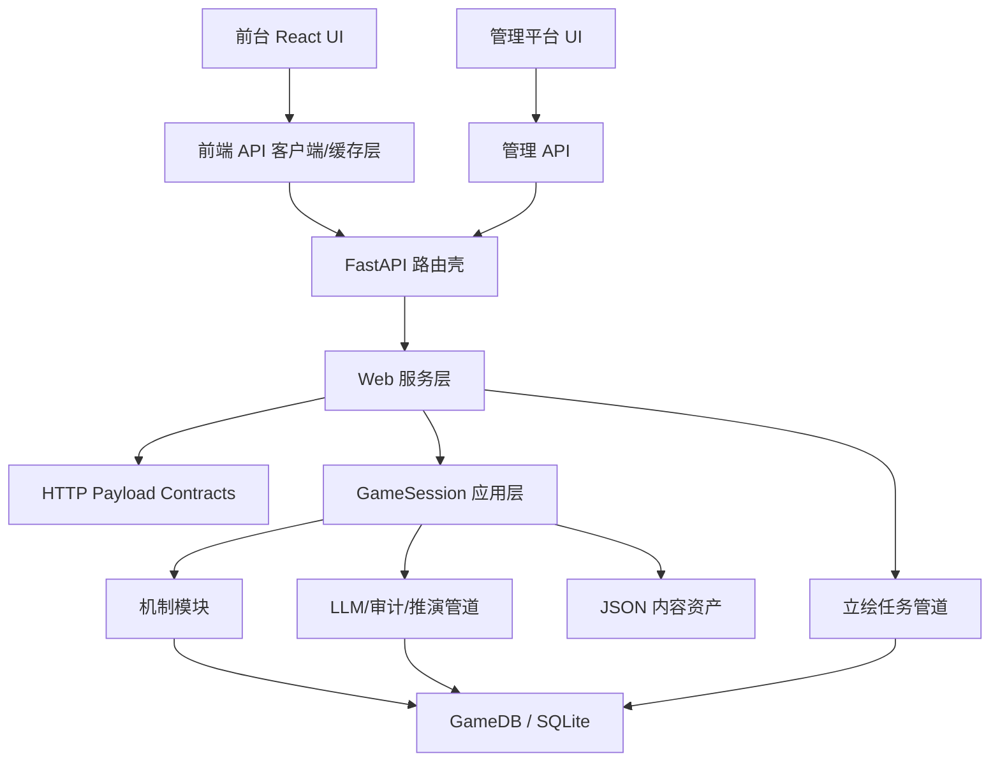

# 工程化模块架构

本文定义项目继续扩展时的工程边界。目标不是一次性重写，而是让前台、后台、管理平台、LLM 管道、立绘管道和机制层都能独立演进、独立测试，并且保持存档兼容。

## 总原则

- **模拟状态不属于前端。** 回合、人物、地区、军队、财政、记忆、握手履约等可存档状态由 `ming_sim` 和 SQLite 负责。
- **Web 入口不承载业务规则。** `web_app.py` 只做鉴权、请求校验、路由编排、错误翻译和响应包装。
- **管道必须有明确契约。** LLM、立绘、数据生成、月末推演、对话审计都要有输入对象、输出对象、失败状态和可测试边界。
- **运行时依赖从轻。** 游戏运行时只读 JSON/SQLite/静态资产，不依赖外部 NPC 源库或一次性生成脚本。
- **管理平台走受限端口。** 管理能力使用白名单表、角色权限和审计日志，不和普通游戏 API 混在一起扩大风险面。
- **性能预算是接口契约。** 首屏 state、按需详情接口、构建产物和 LLM token 上限都要有测试或 probe 约束。

## 目标分层

## 推荐目录边界

| 层 | 当前/目标位置 | 职责 |
| --- | --- | --- |
| 前台 UI | `web/src` | 页面、抽屉、弹窗、交互状态、可视化，不写游戏结算规则。 |
| 前端 API | `web/src/api`（待拆） | fetch、错误格式、缓存、按需加载、compact payload 解码。 |
| Web 路由 | `web_app.py`，长期拆到 `ming_sim/web/routes` | 鉴权、请求/响应、HTTP 状态码、流式输出。 |
| Web 服务 | `ming_sim/web_services.py` 或 `ming_sim/web/*`（待拆） | 把路由请求转成 `GameSession` 调用，处理 Web 专属编排。 |
| Payload 契约 | `ming_sim/web_payloads.py` | HTTP 数据形状、压缩字段表、按需面板 payload。 |
| 管道契约 | `ming_sim/pipeline_registry.py` | 前台、Web、管理、LLM、立绘、机制和数据生成管道的 owner、入口、预算、失败策略。 |
| 模块/扩展契约 | `ming_sim/module_registry.py` | 前台、Web、服务、LLM、立绘、机制、数据模块的依赖、hook、热插拔等级。 |
| 应用层 | `ming_sim/session.py` | 回合主流程、召对、拟旨、月末、存档级协调。 |
| 机制层 | `ming_sim/issues.py`、`bureaucracy.py`、`negotiation.py` 等 | 可复用规则和确定性结算，不知道 FastAPI/React。 |
| LLM 管道 | `ming_sim/agents.py`、`dialogue_audit.py`、`simulation.py` | prompt、模型选择、输出契约、失败处理、token 控制。 |
| 立绘管道 | `ming_sim/portraits.py`，目标拆 `ming_sim/portrait_pipeline.py` | spec、队列、生成、归一化、状态落库、重试策略。 |
| 管理能力 | `GameDB.admin_*`，目标 `ming_sim/admin_services.py` | 白名单表管理、审计、导入导出、数据修复。 |
| 内容生成 | `scripts/generate_*` | 离线生成 JSON，不进入游戏运行时热路径。 |

## 前台工程化

前台要继续从“单文件大应用”拆成四类模块：

- `api/`：`api()`、stream、compact state 解码、局内缓存。所有接口字段变化先在这里适配。
- `state/`：游戏态派生数据，例如人物分组、地图节点装饰、画像 cache bust。
- `panels/`：朝堂、后宫、军队、地区、建筑、任免、组织图、地图情报。
- `components/`：按钮、抽屉、人物卡、状态条、空态、错误态。

第一条已落地的前端边界：

- `web/src/api/client.ts` 负责普通 JSON 请求、SSE 解析、召对流式接口和 API 错误归一化。
- `web/src/api/payloads.ts` 负责 compact 字段表解码、state 归一化、组织图/地图/候见清单的默认值恢复。
- `main.tsx` 不再持有底层 fetch/SSE 实现，也不再持有 compact payload 解码实现；后续新增管理台、LLM 管道状态或立绘任务接口时优先进入 `api/`。

拆分约束：

- 每个 panel 只拿自己需要的 props，不直接持有全局 `GameState`，除非是全局概览类弹窗。
- 长列表和详情分离：列表走轻量卡，详情通过 `/api/characters/{name}` 等接口按需拉。
- 抽屉数据按需加载：组织图、地图详情、候见清单已经采用此模式；地区/军队详情也应沿用。

静态资产发布规则：

- `web/public` 是前端静态资产的权威输入，`web/dist` 只是构建产物，不能手工沉淀长期资产。
- 立绘源文件以 `web/public/portraits` 为准；`npm run build` 会通过 `web/scripts/prune-dist-assets.mjs` 删除 dist 中不再存在于源目录的孤儿立绘。
- 大体积资产进入首屏前必须先判断是否可按需加载、压缩或改为 manifest 引用，避免静态包体持续膨胀。
- 资源裁剪属于构建契约，新增静态资产管道时要配套测试，不能依赖人工清理发布目录。

## 后台工程化

`web_app.py` 的长期目标是变薄：

- 路由层只调用服务对象，不直接拼复杂 payload。
- Web 专属 payload 放入 `ming_sim/web_payloads.py` 或后续 `ming_sim/web/payloads.py`。
- 鉴权、用户目录、运行时 LLM 配置、存档菜单、管理 API 分别拆成 route/service 文件。
- 所有会返回完整 state 的 POST 接口，都通过同一个 response helper，避免接口之间状态新鲜度不一致。

第一条已落地的边界：

- `CHARACTER_CARD_FIELDS`
- `CHARACTER_INDEX_FIELDS`
- `REGION_FIELDS`
- `ARMY_FIELDS`
- `POWER_FIELDS`
- `BUILDING_FIELDS`
- `MAP_NODE_FIELDS`
- `ORG_PERSON_FIELDS`
- `ORG_SLOT_FIELDS`
- `ORG_INSTITUTION_FIELDS`
- `MONTHLY_FOLLOWUP_FIELDS`
- `ISSUE_FIELDS`
- `LEGACY_FIELDS`
- `compact_character_cards`
- `compact_character_index`
- `compact_regions`
- `compact_armies`
- `compact_powers`
- `compact_buildings`
- `compact_map_nodes`
- `compact_organization_payload`
- `compact_monthly_followups`
- `compact_issues`
- `compact_legacies`
- `monthly_followups_payload`

这些已从 `web_app.py` 抽到 `ming_sim/web_payloads.py`。前端在入口解码字段表，业务组件继续消费原结构，避免压缩策略泄漏到页面层。

首屏 `state_payload` 不承载大段态势报告；地区、军队、势力警讯统一通过 `/api/situation_reports` 按需读取。

人物总录 `/api/characters` 返回字段表索引，只保留筛选和列表展示所需字段；人物风格、关系、技能、对话目标等厚数据继续走 `/api/characters/{name}` 详情接口。

人物详情的网络画像必须批量读取关系目标 runtime ref；禁止按每条关系分别查询官职、状态和势力，避免人物志翻阅时出现 N+1 SQL。

人物详情的技能授权必须一次读取并复用到 `available_skill_ids` 与 `skill_source_labels`；禁止按每个技能重复查询 `skill_grants`。

地图详情 `/api/map` 返回节点字段表，并将嵌套的地区、军队、建筑对象分别按字段表压缩；前端解码后仍交给地图组件 `MapNode[]`。

建筑清单 `/api/buildings` 复用 `BUILDING_FIELDS` 字段表，并对 `origin=preset`、空产出指标等尾部默认值做裁剪。

组织图 `/api/organizations` 与增设机构返回的 `organizations` 都使用三层字段表压缩：机构、席位、任职人。前端解码后仍交给组织抽屉 `OrganizationPayload`。

候见清单 `/api/monthly_followups` 使用字段表和响应级共享默认值；重复的标题、摘要、开场建议和立场只在顶层传一次，前端解码后仍交给面板 `MonthlyFollowup[]`。

第二条已落地的边界：

- `PipelineSpec`
- `PIPELINE_REGISTRY`
- `pipeline_specs`
- `advanced_llm_roles`
- `llm_output_token_budget`

这些集中在 `ming_sim/pipeline_registry.py`。注册表覆盖前台解码、Web state/detail、管理台、LLM、立绘、机制结算和 NPC 离线生成。新增管道时先登记 owner、entrypoint、读写对象、失败策略和预算，再接入具体实现。

第三条已落地的边界：

- `ModuleSpec`
- `HookSpec`
- `MODULE_REGISTRY`
- `module_dependency_order`
- `modules_for_hook`
- `validate_module_registry`
- `HookRunner`
- `build_default_hook_runner`

这些集中在 `ming_sim/module_registry.py` 和 `ming_sim/hook_runner.py`。模块注册表描述“谁依赖谁、暴露什么 hook、能否准热插拔”；hook runner 只接受可信代码显式注册已声明 hook 的 handler，不动态 import 任意外部代码。后续要把地区、军队、建筑、组织、立绘、LLM 管道进一步插件化时，先登记模块和 hook，再逐步接入 runner。

当前第一处运行时接入点是 `GameSession.begin_turn()` 的 `turn.load` hook：回合加载完成后，runner 接收 `TurnSnapshot` 并可做纯快照层变换或观察，不直接写 DB。默认 runner 没有 handler，既有 CLI/Web 行为保持不变。

`HookRunner` 会保留最近若干次运行的 payload-free summary：hook 名、handler 数、已执行 handler、失败 handler、fail-closed 状态和成功标记。`diagnostics()` 可以把已注册 handler 和最近运行记录转成可序列化 dict，供未来管理台/调试面板读取；记录不保存 payload/result，避免把玩家对话、LLM 上下文或完整游戏态带进调试缓存。

第二处运行时接入点是 Web 游戏数据响应的 `web.payload.encode` hook：`WebGame.state_payload()`、按需面板接口和带 state 的操作响应组装完成后，runner 接收 `{route, method, surface, route_spec, payload}` 并返回新的 payload dict，用于受信模块做响应契约观察、压缩实验或管理调试；handler 不接收 `WebGame` 实例，避免扩展代码直接触碰 DB/session 内部。LLM 配置、管理接口、文件流和 SSE 流保持独立边界，后续如需扩展应单独声明 hook。

`ming_sim/web_route_contracts.py` 是 Web API route 分类表：payload hook allowlist 用 `WebPayloadRouteSpec` 登记，非 hook 路由用 `EXCLUDED_WEB_PAYLOAD_ROUTES` 写清边界原因。新增 Web 游戏数据接口时，先登记 route、methods、surface、是否包含 state、是否 compact，再在 `web_app.py` 接入 `_web_payload_response()`；多 method route 必须显式传 `method=`，敏感配置、管理、文件、SSE、chat/history/save 专用边界必须登记排除说明或另建专用 hook，不能默认复用 `web.payload.encode`。

`ming_sim/web_payload_hooks.py` 负责构造 `web.payload.encode` envelope、调用 `HookRunner`、解析 handler 返回，并统一拼接 mutation response 的 refreshed `state`；`web_app.py` 只保留路由层 facade，不内联 hook payload 细节。

准热插拔等级：

- `static`：代码级模块，需重新构建/部署。
- `restart_required`：运行时入口或路由层，需重启服务。
- `session_reload`：可通过重建局内 session/registry 生效，不改存档 schema。
- `declarative`：数据、配置或资产规则变化可由构建/管理流程刷新。
- `runtime_safe`：低风险纯规则或可幂等观察 hook，允许未来接入运行时重注册；高风险写存档模块不得标成此等级。

## 管理平台工程化

管理能力需要和普通游戏 API 分开：

- 管理 API 必须要求管理员身份，不复用普通玩家会话权限。
- 表操作必须保留白名单，禁止任意 SQL。
- 修改高风险表时写审计日志：用户、表名、主键、字段 diff、时间。
- 管理 UI 只呈现 schema 已知的编辑器；导入数据先 dry-run，再 apply。
- 对 `characters`、`npc_network`、`portrait_assets`、`conversation_goals`、`negotiation_agreements` 增加专用检查页。

## LLM 管道工程化

LLM 调用应当按“角色”管理，而不是散落调用：

| 管道 | 输入 | 输出 | 失败策略 |
| --- | --- | --- | --- |
| 大臣召对 | 人物上下文、关系、记忆、对话目标 | 角色回复、工具调用、审计事件 | LLM 错误即报错，不伪造回复。 |
| 奏对审计 | 玩家话术、NPC 回复、目标/握手状态 | goal/stance/agreement 更新 | 失败不落档，返回可见提示。 |
| 拟旨解析 | 玩家诏书自然语言 | 结构化 decree/directive | 契约失败阻断确认。 |
| 月末推演 | 当前局势、诏令、承办画像、履约证据 | 邸报、数值变化、结案/新局势 | 契约失败阻断结算。 |
| 章节记忆 | 月报、关键人物/地点/派系 | 可召回记忆 | 失败不影响主结算。 |

管道约束：

- prompt 文件只定义角色和输出契约，不承担业务 fallback。
- LLM 管道必须在 `ming_sim/pipeline_registry.py` 登记 `llm_role`、是否使用 advanced model、默认输出预算和失败策略。
- 每个管道都应记录 token、模型、耗时、失败阶段。
- 高 token 上下文必须有摘要/裁剪策略：人物网络、记忆、历史章节、组织图分别限量。
- 结构化输出先校验再入库，禁止“看起来像 JSON 就落库”。
- 低价值长尾输出默认收口：章节记忆、拟旨润色、JSON 修复、结局总结走注册表默认 token 预算；月末推演和结构化提取仍吃全局上限。

## 立绘 API 管道工程化

立绘生成要从 WebGame 方法逐步迁出为任务管道：

目标能力：

- 同一 `asset_id` 幂等，不重复烧 API。
- 队列 worker 有并发上限和错误重试次数。
- 图片归一化失败写 `error`，不破坏角色现有可用头像。
- 生成配置、模型名、参考图来源进入元数据，方便复现。

## 机制层工程化

机制层应当是可测试的纯规则优先：

- 握手履约：只依赖 agreement/task/evidence，不读 Web 状态。
- 组织承办：只依赖官署、职位、人物能力、风险条件和资源。
- 地区/军队/建筑：每个模块有独立 payload、report、apply 函数。
- 新机制先进入 `ming_sim/<domain>.py`，再由 `GameSession` 编排。
- 机制的日志和玩家可见文案分开：日志服务审计，文案服务体验。

## 迁移路线

1. **Web payload 契约模块化**：已开始，继续把 state/detail/index payload 从 `web_app.py` 抽离。
2. **Pipeline registry**：已落地，统一工程管道 owner、入口、预算、失败策略和 advanced 模型角色。
3. **Module registry**：已落地，统一模块依赖、hook、热插拔等级和准插件化边界。
4. **前端 API 层拆分**：把 `api()`、stream、state 解码、按需缓存从 `main.tsx` 拆到 `web/src/api`。
5. **Web 路由分组**：把 auth/menu/game/admin/portrait/history routes 拆成文件，保留一个 app factory。
6. **立绘任务管道**：把 `queue_portrait_generation` 迁出 WebGame，路由只提交任务和查询状态。
7. **LLM pipeline runner**：在注册表基础上统一模型调用、token 限额、耗时记录、错误格式。
8. **管理平台服务层**：为数据编辑、质量检查、导入导出建立专用 service 和测试。
9. **机制插件化**：让地区、军队、建筑、组织承办都暴露同形态的 report/apply/probe。

## 质量门禁

每次拆模块都必须跑：

- `python3 -m unittest discover -s tests -p 'test*.py'`
- `npm run build`
- Web 首屏 smoke test

关键预算：

- `/api/game/state` 保持轻量，重数据走按需接口。
- 态势长文本、组织图、地图详情、月度追问等不进入首屏 state。
- 首屏 HTML 不依赖外部字体服务；字体使用本地/系统中文 serif 栈，避免 DNS/TLS 与字体阻塞。
- 不新增首屏 N+1 SQL。
- 新增 LLM、立绘、机制、管理或数据生成管道时必须登记 `PIPELINE_REGISTRY`，并写清失败策略。
- 新增前台、Web、服务、LLM、立绘、机制或数据模块时必须登记 `MODULE_REGISTRY`，并通过 `validate_module_registry()`。
- 管理 API 不能绕过鉴权和表白名单。
- LLM 管道不能静默 fallback 成虚假成功。
- 立绘 worker 失败不能影响主游戏回合推进。
